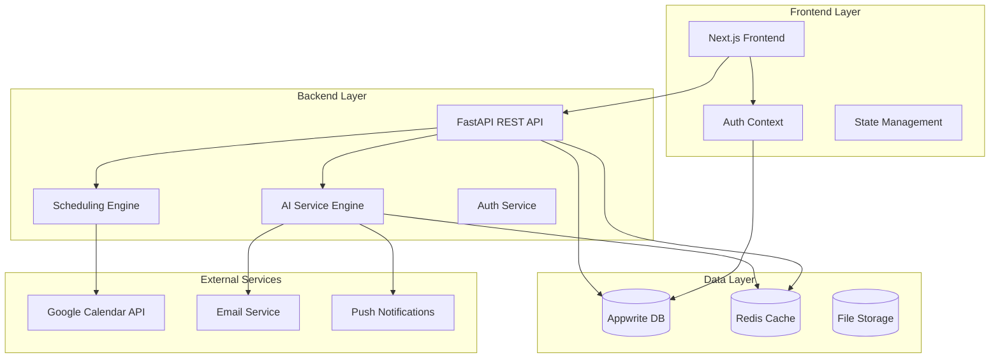
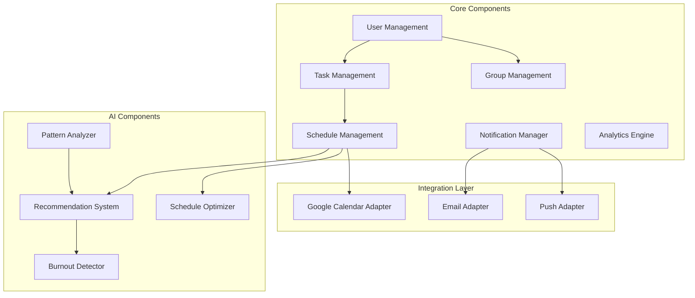
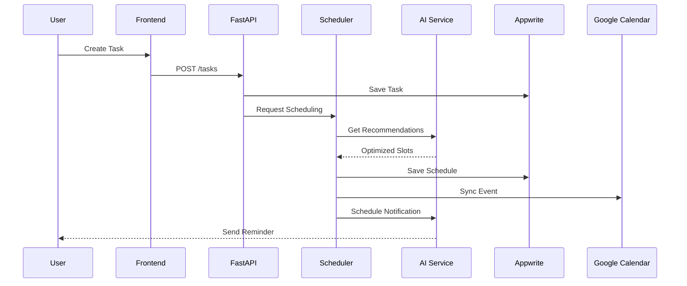
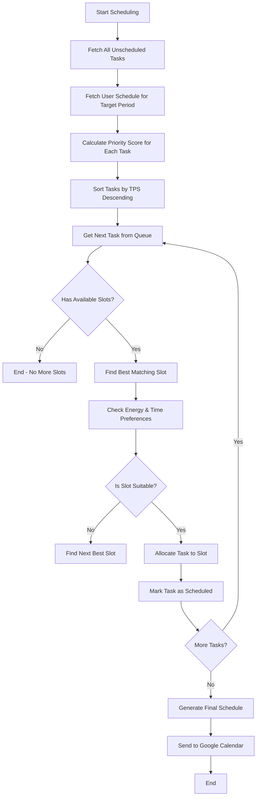
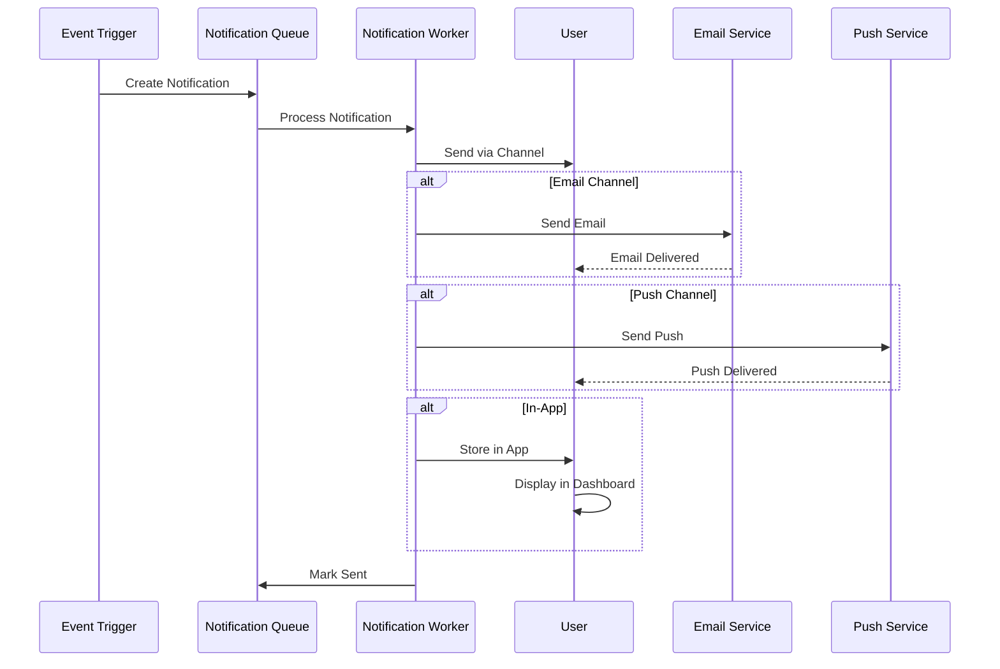
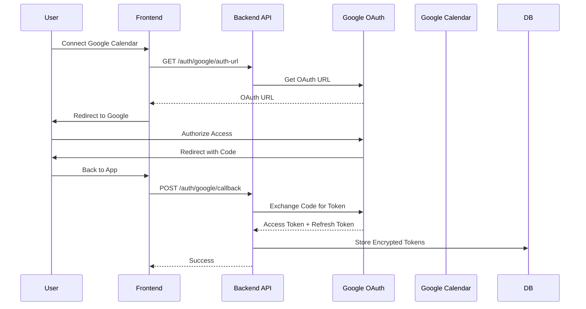
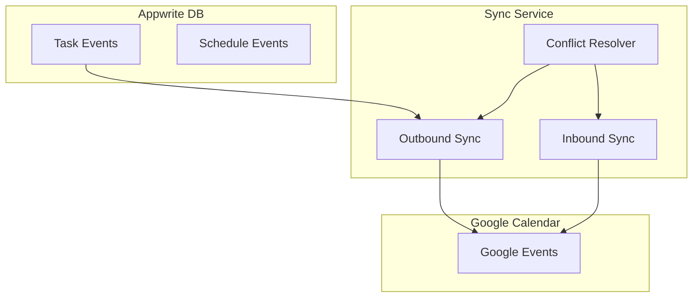
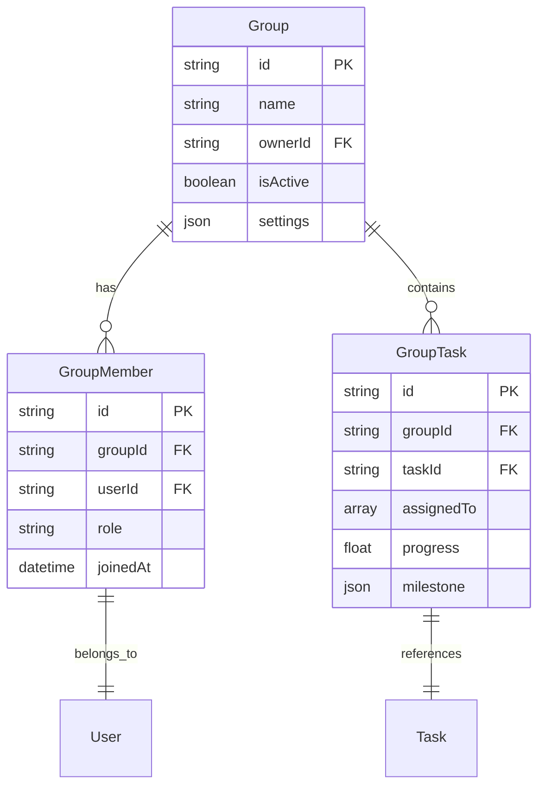
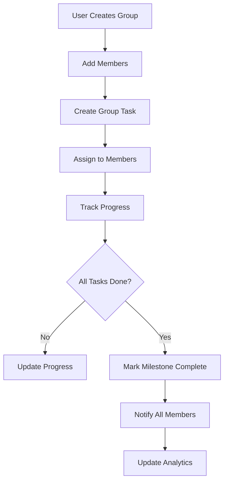
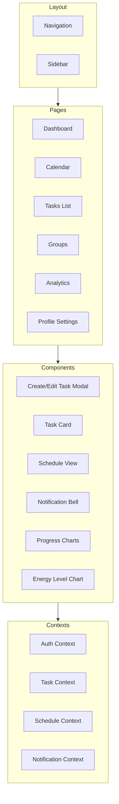

# Student Task Management & Scheduling System
## Comprehensive Architecture Document

**Version:** 1.0  
**Date:** February 2025  
**Status:** Design Specification

---

## Table of Contents

1. [Executive Summary](#executive-summary)
2. [System Overview](#system-overview)
3. [Architecture Design](#architecture-design)
4. [Database Schema](#database-schema)
5. [API Endpoint Specifications](#api-endpoint-specifications)
6. [Priority Scheduling Algorithm](#priority-scheduling-algorithm)
7. [Notification System](#notification-system)
8. [Google Calendar Integration](#google-calendar-integration)
9. [Group Collaboration Features](#group-collaboration-features)
10. [Frontend Architecture](#frontend-architecture)
11. [Security Considerations](#security-considerations)
12. [Implementation Roadmap](#implementation-roadmap)

---

## Executive Summary

The Student Task Management & Scheduling System is a comprehensive platform designed to help students manage academic and personal tasks through intelligent, rule-based priority scheduling. The system leverages AI-powered recommendations, integrates with external calendars, supports group collaboration, and provides detailed analytics to maximize student productivity.

**Key Features:**
- Rule-based priority scheduling with 1-hour time slot resolution
- Energy level and time-of-day preferences for task allocation
- Email and in-app notifications for reminders and deadlines
- Comprehensive analytics and progress tracking
- Google Calendar two-way sync
- Group collaboration for team projects
- AI-powered recommendations for breaks, burnout detection, and productivity optimization

---

## System Overview

### High-Level Architecture



### Technology Stack

| Layer | Technology | Purpose |
|-------|------------|---------|
| **Frontend** | Next.js 14+ (React) | UI/UX, Dashboard, Components |
| **Backend** | Python FastAPI | REST API, Business Logic |
| **Database** | Appwrite | Primary Database, Auth |
| **Caching** | Redis | Session Cache, Rate Limiting |
| **AI/ML** | Python (scikit-learn, pandas) | Recommendations, Pattern Analysis |
| **Calendar Sync** | Google Calendar API | External Calendar Integration |
| **Email** | SMTP/Email Service | Notifications |
| **Notifications** | Web Push API | In-app Push Notifications |

---

## Architecture Design

### Component Architecture



### System Flow



---

## Database Schema

### Appwrite Database Structure

#### 1. Users Collection (`users`)

| Attribute | Type | Required | Description |
|-----------|------|----------|-------------|
| `userId` | string | Yes | Appwrite User ID (reference) |
| `email` | string | Yes | User email |
| `displayName` | string | No | Display name |
| `timezone` | string | No | User timezone (default: UTC) |
| `googleCalendarToken` | json | No | OAuth tokens for Google Calendar |
| `notificationPrefs` | json | No | Notification preferences |
| `createdAt` | datetime | Yes | Creation timestamp |
| `updatedAt` | datetime | Yes | Last update timestamp |

#### 2. Tasks Collection (`tasks`)

| Attribute | Type | Required | Description |
|-----------|------|----------|-------------|
| `title` | string | Yes | Task title |
| `description` | string | No | Task description |
| `userId` | string | Yes | Owner user ID |
| `groupId` | string | No | Group ID (if group task) |
| `category` | string | Yes | academic/personal/other |
| `courseId` | string | No | Related course |
| `priority` | enum | Yes | Critical/High/Medium/Low |
| `status` | enum | Yes | To Do/In Progress/Blocked/Done |
| `estimatedHours` | float | Yes | Estimated time to complete |
| `actualHours` | float | No | Actual time spent |
| `deadline` | datetime | Yes | Task deadline |
| `scheduledStart` | datetime | No | Scheduled start time |
| `scheduledEnd` | datetime | No | Scheduled end time |
| `completedAt` | datetime | No | Completion timestamp |
| `energyLevel` | enum | No | high/medium/low (preferred energy) |
| `recurring` | json | No | Recurrence rules |
| `tags` | array | No | Task tags |
| `createdAt` | datetime | Yes | Creation timestamp |
| `updatedAt` | datetime | Yes | Last update timestamp |

#### 3. User Schedules Collection (`user_schedules`)

| Attribute | Type | Required | Description |
|-----------|------|----------|-------------|
| `userId` | string | Yes | User ID |
| `date` | date | Yes | Schedule date |
| `dayOfWeek` | integer | Yes | 0-6 (Sunday-Saturday) |
| `freeSlots` | json | Yes | Array of available time slots |
| `fixedCommitments` | json | No | Array of fixed commitments |
| `studySlots` | json | No | Preferred study times |
| `sleepSchedule` | json | No | Sleep time preferences |
| `createdAt` | datetime | Yes | Creation timestamp |
| `updatedAt` | datetime | Yes | Last update timestamp |

#### 4. Groups Collection (`groups`)

| Attribute | Type | Required | Description |
|-----------|------|----------|-------------|
| `name` | string | Yes | Group name |
| `description` | string | No | Group description |
| `ownerId` | string | Yes | Owner user ID |
| `memberIds` | array | Yes | Array of member user IDs |
| `isActive` | boolean | Yes | Active status |
| `settings` | json | No | Group settings |
| `createdAt` | datetime | Yes | Creation timestamp |
| `updatedAt` | datetime | Yes | Last update timestamp |

#### 5. Group Tasks Collection (`group_tasks`)

| Attribute | Type | Required | Description |
|-----------|------|----------|-------------|
| `groupId` | string | Yes | Group ID |
| `taskId` | string | Yes | Task ID |
| `assignedTo` | array | No | Assigned members |
| `milestone` | json | No | Milestone info |
| `progress` | float | No | Completion percentage |
| `createdAt` | datetime | Yes | Creation timestamp |
| `updatedAt` | datetime | Yes | Last update timestamp |

#### 6. Notifications Collection (`notifications`)

| Attribute | Type | Required | Description |
|-----------|------|----------|-------------|
| `userId` | string | Yes | Target user ID |
| `type` | enum | Yes | reminder/deadline/progress/alert |
| `title` | string | Yes | Notification title |
| `message` | string | Yes | Notification message |
| `taskId` | string | No | Related task ID |
| `scheduledFor` | datetime | No | When to send |
| `sentAt` | datetime | No | When sent |
| `read` | boolean | Yes | Read status |
| `channel` | enum | Yes | email/in_app/push |
| `createdAt` | datetime | Yes | Creation timestamp |

#### 7. Analytics Collection (`analytics`)

| Attribute | Type | Required | Description |
|-----------|------|----------|-------------|
| `userId` | string | Yes | User ID |
| `date` | date | Yes | Analytics date |
| `tasksCompleted` | integer | Yes | Number completed |
| `totalHoursWorked` | float | Yes | Total hours |
| `productivityScore` | float | No | Daily productivity (0-100) |
| `categoryBreakdown` | json | No | Hours per category |
| `peakHours` | json | No | Most productive hours |
| `goalsMet` | array | No | Goals achieved |
| `createdAt` | datetime | Yes | Creation timestamp |

---

## API Endpoint Specifications

### Authentication Endpoints

```yaml
/auth:
  POST /auth/login:
    description: User login
    body:
      email: string
      password: string
    response: { token: string, user: User }

  POST /auth/register:
    description: User registration
    body:
      email: string
      password: string
      name: string
    response: { user: User }

  POST /auth/logout:
    description: User logout
    response: { success: boolean }

  GET /auth/me:
    description: Get current user
    response: { user: User }

  POST /auth/google:
    description: Google OAuth login
    body:
      token: string
    response: { token: string, user: User }
```

### Task Endpoints

```yaml
/tasks:
  GET /tasks:
    description: List user's tasks
    query:
      - status (optional)
      - priority (optional)
      - category (optional)
      - from (optional date)
      - to (optional date)
    response: { tasks: Task[], total: int }

  POST /tasks:
    description: Create new task
    body:
      title: string
      description: string
      category: string
      priority: string
      estimatedHours: number
      deadline: datetime
      energyLevel: string
      courseId: string
      recurring: object
    response: { task: Task }

  GET /tasks/{id}:
    description: Get task by ID
    response: { task: Task }

  PUT /tasks/{id}:
    description: Update task
    body: (partial task object)
    response: { task: Task }

  DELETE /tasks/{id}:
    description: Delete task
    response: { success: boolean }

  POST /tasks/{id}/complete:
    description: Mark task as complete
    body:
      actualHours: number
    response: { task: Task, analytics: Analytics }

  POST /tasks/{id}/schedule:
    description: Request scheduling for task
    body:
      preferredSlots: array
    response: { scheduledTask: Task }
```

### Schedule Endpoints

```yaml
/schedule:
  GET /schedule:
    description: Get user's schedule
    query:
      - date (optional)
      - from (optional date)
      - to (optional date)
    response: { schedule: Schedule, tasks: Task[] }

  PUT /schedule:
    description: Update user schedule
    body:
      freeSlots: array
      fixedCommitments: array
      studySlots: array
      sleepSchedule: object
    response: { schedule: Schedule }

  POST /schedule/generate:
    description: Generate optimal schedule
    query:
      - date (required)
    response: { generatedSchedule: Schedule }

  POST /schedule/sync-google:
    description: Sync with Google Calendar
    response: { synced: boolean }
```

### Group Endpoints

```yaml
/groups:
  GET /groups:
    description: List user's groups
    response: { groups: Group[] }

  POST /groups:
    description: Create new group
    body:
      name: string
      description: string
      memberIds: array
    response: { group: Group }

  GET /groups/{id}:
    description: Get group details
    response: { group: Group, tasks: Task[], members: User[] }

  PUT /groups/{id}:
    description: Update group
    body: (partial group object)
    response: { group: Group }

  DELETE /groups/{id}:
    description: Delete group
    response: { success: boolean }

  POST /groups/{id}/members:
    description: Add member to group
    body:
      userId: string
    response: { member: User }

  DELETE /groups/{id}/members/{userId}:
    description: Remove member from group
    response: { success: boolean }

  GET /groups/{id}/tasks:
    description: Get group tasks
    response: { tasks: Task[], progress: float }
```

### Analytics Endpoints

```yaml
/analytics:
  GET /analytics:
    description: Get user analytics
    query:
      - from (required date)
      - to (required date)
      - type (daily/weekly/monthly)
    response:
      completionRate: number
      productivityTrend: array
      categoryBreakdown: object
      peakHours: array
      burnoutRisk: number
      recommendations: array

  GET /analytics/productivity:
    description: Get productivity scores
    query:
      - from (required date)
      - to (required date)
    response: { scores: array, average: number }

  GET /analytics/goals:
    description: Get goal progress
    response: { goals: array, completionRate: number }
```

### Notification Endpoints

```yaml
/notifications:
  GET /notifications:
    description: List user notifications
    query:
      - unreadOnly (optional)
      - limit (optional)
    response: { notifications: Notification[] }

  PUT /notifications/{id}/read:
    description: Mark notification as read
    response: { success: boolean }

  PUT /notifications/read-all:
    description: Mark all notifications as read
    response: { success: boolean }

  PUT /notifications/preferences:
    description: Update notification preferences
    body:
      emailEnabled: boolean
      pushEnabled: boolean
      reminderTimes: array
    response: { preferences: object }
```

### AI/Recommendations Endpoints

```yaml
/ai:
  POST /ai/recommendations:
    description: Get AI recommendations
    body:
      context: object
    response:
      suggestions: array
      burnoutRisk: number
      optimalSlots: array

  POST /ai/analyze-patterns:
    description: Analyze productivity patterns
    response:
      patterns: array
      insights: array
      predictions: array

  POST /ai/optimize-schedule:
    description: Optimize existing schedule
    body:
      schedule: object
      tasks: array
    response:
      optimizedSchedule: object
      improvements: array

  GET /ai/burnout-indicator:
    description: Get burnout risk indicator
    response:
      level: string
      score: number
      recommendations: array
```

---

## Priority Scheduling Algorithm

### Algorithm Overview

The scheduling algorithm uses a multi-factor scoring system to prioritize and allocate tasks to available time slots based on:

1. **Deadline Urgency Score** - How close is the deadline?
2. **Importance Score** - Task weight and impact
3. **Category Priority** - Academic vs personal task weighting
4. **Energy Matching** - Match task energy requirements with user energy patterns
5. **Time Preference** - User's preferred time slots for task types

### Scoring Formula

```
Task Priority Score (TPS) = (Deadline Score × Wd) + (Importance Score × Wi) + 
                           (Category Score × Wc) + (Energy Score × We) +
                           (User Preference Score × Wp)

Where:
  Wd = Deadline Weight (0.35)
  Wi = Importance Weight (0.25)
  Wc = Category Weight (0.15)
  We = Energy Matching Weight (0.15)
  Wp = User Preference Weight (0.10)
```

### Deadline Score Calculation

```
Deadline Score = 
  If deadline < 24 hours: 100
  If deadline < 48 hours: 85
  If deadline < 7 days: 70
  If deadline < 14 days: 50
  If deadline < 30 days: 30
  If deadline > 30 days: 10

Linear interpolation within each range:
Score = Base + (RemainingHours / TotalHours) × (NextTier - Base)
```

### Energy Matching Score

```
Energy Score = 
  If task.energyLevel == 'high' and slot.energyLevel == 'high': 100
  If task.energyLevel == 'high' and slot.energyLevel == 'medium': 60
  If task.energyLevel == 'high' and slot.energyLevel == 'low': 20
  If task.energyLevel == 'medium' and slot.energyLevel == 'high': 80
  If task.energyLevel == 'medium' and slot.energyLevel == 'medium': 100
  If task.energyLevel == 'medium' and slot.energyLevel == 'low': 60
  If task.energyLevel == 'low' and slot.energyLevel == 'high': 50
  If task.energyLevel == 'low' and slot.energyLevel == 'medium': 80
  If task.energyLevel == 'low' and slot.energyLevel == 'low': 100
```

### Scheduling Algorithm Steps



### AI-Powered Schedule Optimization

The AI service enhances the basic algorithm with:

1. **Pattern Recognition**: Learns from user's past productivity data
2. **Burnout Detection**: Monitors workload intensity
3. **Smart Break Suggestions**: Recommends break intervals
4. **Energy Curve Analysis**: Identifies peak productive hours
5. **Adaptive Weighting**: Adjusts algorithm weights based on effectiveness

```python
class ScheduleOptimizer:
    def optimize(self, tasks: List[Task], schedule: Schedule) -> Schedule:
        # Load user's productivity patterns
        patterns = self.load_patterns(schedule.userId)
        
        # Calculate optimal task ordering
        optimized_tasks = self.reorder_tasks(tasks, patterns)
        
        # Adjust for burnout prevention
        adjusted_schedule = self.prevent_burnout(optimized_tasks)
        
        # Add recommended breaks
        final_schedule = self.add_breaks(adjusted_schedule)
        
        return final_schedule
```

---

## Notification System

### Notification Types

| Type | Description | Channels |
|------|-------------|----------|
| `deadline_approaching` | Task deadline within 24 hours | Email, Push, In-app |
| `deadline_today` | Task deadline today | Email, Push, In-app |
| `reminder` | Scheduled task reminder | Push, In-app |
| `task_assigned` | Group task assigned to user | Email, Push, In-app |
| `schedule_updated` | Schedule changed | Push, In-app |
| `group_update` | Group activity update | Push, In-app |
| `productivity_tip` | AI productivity suggestion | In-app |
| `burnout_warning` | Burnout risk detected | Email, Push, In-app |
| `goal_achieved` | Goal milestone reached | Email, Push, In-app |
| `weekly_summary` | Weekly progress summary | Email, In-app |

### Notification Workflow



### Notification Preferences Schema

```json
{
  "userId": "string",
  "preferences": {
    "email": {
      "enabled": true,
      "reminderTimes": [60, 30, 15], // minutes before deadline
      "dailyDigest": true,
      "weeklySummary": true
    },
    "push": {
      "enabled": true,
      "reminderTimes": [60, 30, 15, 0],
      "quietHours": {
        "enabled": true,
        "start": "22:00",
        "end": "08:00"
      }
    },
    "inApp": {
      "enabled": true,
      "showAll": false,
      "priorityThreshold": "medium"
    }
  }
}
```

### Reminder Scheduling

```python
class NotificationScheduler:
    def schedule_reminders(self, task: Task, user: User) -> List[Notification]:
        notifications = []
        prefs = user.notificationPrefs
        
        if prefs.email.enabled:
            for minutes in prefs.email.reminderTimes:
                notification = self.create_email_reminder(task, minutes)
                notifications.append(notification)
        
        if prefs.push.enabled:
            for minutes in prefs.push.reminderTimes:
                notification = self.create_push_reminder(task, minutes)
                notifications.append(notification)
        
        return notifications
```

---

## Google Calendar Integration

### OAuth 2.0 Flow



### Two-Way Sync Architecture



### Sync Operations

```python
class GoogleCalendarSync:
    def sync_to_google(self, event: Task) -> str:
        """Push task event to Google Calendar"""
        calendar_id = 'primary'
        
        google_event = {
            'summary': event.title,
            'description': event.description,
            'start': {
                'dateTime': event.scheduledStart.isoformat(),
                'timeZone': event.timezone
            },
            'end': {
                'dateTime': event.scheduledEnd.isoformat(),
                'timeZone': event.timezone
            },
            'reminders': {
                'useDefault': False,
                'overrides': [
                    {'method': 'email', 'minutes': 60},
                    {'method': 'popup', 'minutes': 30}
                ]
            }
        }
        
        if event.googleEventId:
            # Update existing
            return self.service.events().update(
                calendarId=calendar_id,
                eventId=event.googleEventId,
                body=google_event
            ).execute()
        else:
            # Create new
            return self.service.events().insert(
                calendarId=calendar_id,
                body=google_event
            ).execute()
```

### Conflict Resolution

| Conflict Type | Resolution Strategy |
|---------------|---------------------|
| Time Overlap | Merge events, prefer Google if user edited there |
| Task Deleted in App | Delete Google event |
| Task Deleted in Google | Keep in App, mark as unsynced |
| Both Edited | Use latest modification timestamp |

---

## Group Collaboration Features

### Group Data Model



### Group Workflow



### Group Task Assignment

```python
class GroupTaskManager:
    def assign_task(self, task_id: str, group_id: str, member_ids: List[str]) -> GroupTask:
        """Assign a task to group members"""
        group_task = GroupTask(
            taskId=task_id,
            groupId=group_id,
            assignedTo=member_ids,
            progress=0.0
        )
        
        # Notify assigned members
        for member_id in member_ids:
            self.notification_service.send(
                userId=member_id,
                type='task_assigned',
                taskId=task_id,
                groupId=group_id
            )
        
        return group_task
```

---

## Frontend Architecture

### Component Hierarchy



### State Management

| State | Management | Purpose |
|-------|------------|---------|
| User Auth | Context + LocalStorage | Authentication state |
| Tasks | React Query + Context | Task data caching |
| Schedule | Context + Server State | Schedule data |
| Notifications | Context + SWR | Real-time notifications |
| UI State | Local State | Modal states, form inputs |

### Key Pages

1. **Dashboard** - Overview of tasks, progress, daily schedule
2. **Calendar** - Monthly/weekly view with scheduled tasks
3. **Tasks** - Filterable task list with CRUD operations
4. **Groups** - Group management and collaboration
5. **Analytics** - Productivity trends, charts, insights
6. **Profile** - User settings, notification preferences, calendar sync

---

## Security Considerations

### Authentication & Authorization

```yaml
Security Measures:
  - Appwrite for authentication
  - JWT token validation on all API requests
  - Role-based access control for groups
  - Resource-level permissions
  
  Group Permissions:
    - Owner: Full access
    - Admin: Edit, delete, manage members
    - Member: View, complete assigned tasks
    - Viewer: View only
```

### Data Protection

| Data Type | Protection |
|-----------|-----------|
| User credentials | Appwrite-managed |
| Google OAuth tokens | Encrypted at rest |
| Notification preferences | User-controlled |
| Personal data | GDPR compliant |

### API Security

```python
# Rate limiting
class RateLimiter:
    limits = {
        'default': '100/hour',
        'auth': '10/hour',
        'analytics': '50/hour'
    }

# Input validation
class TaskValidator:
    @validator('title')
    def title_not_empty(cls, v):
        assert len(v) > 0, 'Title cannot be empty'
        assert len(v) < 256, 'Title too long'
        return v
```

---

## Implementation Roadmap

### Phase 1: Core Foundation
- [ ] Expand database schema in Appwrite
- [ ] Implement task CRUD with full validation
- [ ] Build user schedule management
- [ ] Create authentication integration
- [ ] Develop task modal component

### Phase 2: Scheduling Engine
- [ ] Implement priority scoring algorithm
- [ ] Build schedule generation service
- [ ] Create AI recommendation service
- [ ] Develop energy level matching
- [ ] Implement schedule optimization

### Phase 3: Notifications
- [ ] Build notification service
- [ ] Implement email notifications
- [ ] Create push notification system
- [ ] Develop notification preferences UI
- [ ] Implement reminder scheduling

### Phase 4: Integrations
- [ ] Google OAuth implementation
- [ ] Two-way Google Calendar sync
- [ ] Conflict resolution system
- [ ] Calendar view components
- [ ] Sync status indicators

### Phase 5: Group Collaboration
- [ ] Group management system
- [ ] Group task assignment
- [ ] Progress tracking per group
- [ ] Group notifications
- [ ] Shared calendar view

### Phase 6: Analytics & AI
- [ ] Productivity tracking service
- [ ] Burnout detection algorithm
- [ ] Analytics dashboard
- [ ] Pattern analysis service
- [ ] AI recommendations UI

### Phase 7: Polish & Testing
- [ ] UI/UX improvements
- [ ] Performance optimization
- [ ] Security audit
- [ ] Integration testing
- [ ] User feedback implementation

---

## Appendices

### Appendix A: Environment Variables

```env
# Appwrite
NEXT_PUBLIC_APPWRITE_ENDPOINT=https://cloud.appwrite.io/v1
NEXT_PUBLIC_APPWRITE_PROJECT_ID=your_project_id
NEXT_PUBLIC_APPWRITE_DATABASE_ID=scheduler_db

# Google Calendar
GOOGLE_CLIENT_ID=your_client_id
GOOGLE_CLIENT_SECRET=your_client_secret
GOOGLE_REDIRECT_URI=http://localhost:3000/api/auth/google/callback

# Backend
APPWRITE_API_KEY=your_api_key
DATABASE_URL=postgresql://...

# Email
SMTP_HOST=smtp.example.com
SMTP_PORT=587
SMTP_USER=your_email
SMTP_PASSWORD=your_password
```

### Appendix B: Database Indexes

```sql
-- Tasks collection indexes
CREATE INDEX idx_tasks_userId ON tasks(userId);
CREATE INDEX idx_tasks_status ON tasks(status);
CREATE INDEX idx_tasks_deadline ON tasks(deadline);
CREATE INDEX idx_tasks_priority ON tasks(priority);
CREATE INDEX idx_tasks_category ON tasks(category);
CREATE INDEX idx_tasks_scheduledStart ON tasks(scheduledStart);

-- User schedules indexes
CREATE INDEX idx_schedule_userDate ON user_schedules(userId, date);

-- Notifications indexes
CREATE INDEX idx_notifications_userRead ON notifications(userId, read);
CREATE INDEX idx_notifications_scheduled ON notifications(scheduledFor);
```

### Appendix C: Error Codes

| Code | Description |
|------|-------------|
| AUTH_001 | Invalid credentials |
| AUTH_002 | Token expired |
| TASK_001 | Task not found |
| TASK_002 | Invalid task data |
| TASK_003 | Cannot schedule task |
| SCHEDULE_001 | No available slots |
| SCHEDULE_002 | Schedule conflict |
| GOOGLE_001 | Google auth failed |
| GOOGLE_002 | Sync failed |
